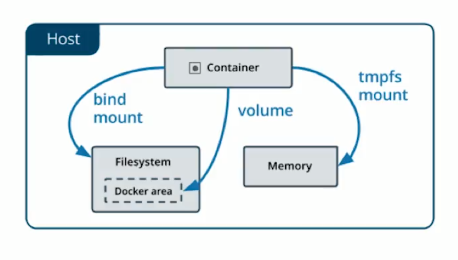

# Docker
Docker is an open platform to build, ship, and run distributed applications. It is written in Go. It was first released in 2013 and is developed by Docker, Inc.

Docker is used to run packages called “containers”. Containers are isolated from each others and from the OS. These are more lightweight than virtual machines as they do not use the host machine to run an operating system.

Containerization, which is a way of deploying and running applications, runs isolated services which run natively on the Linux kernel. Memory can be set manually for each container in Docker.

Docker is used to simplify configurations, and ensure a smooth continuous integration and deployment flow. Specific containers can be specified for development, staging, and production environments. A true implementation of a container in production, according to the Docker manual, is to run it as a service, using the docker-compose.yml file for setup. This is a YAML file that defines how Docker containers should behave in production.

One of Docker’s biggest advantages is that it can be used by a team using different operateing systems to build projects without needing to worry about software conflicts.

## Arquitectura de Docker
Tiene una arquitectura de cliente-servidor.
El servidor es un daemon que esta corriendo en mi maquina y el cliente es otro programa que también esta corriendo en mi maquina.
Cuando escribimos docker y damos enter, estamos usando el cliente, y este por detrás le habla al daemon (servicio de docker).
No es necesario que el daemon este corriendo en mi maquina, desde mi cliente puedo hablarle a un daemon que este corriendo en otra maquina.
Básicamente lo que pasa cuando ejecutamos docker run: mi cliente le habla al daemon, el daemon hizo todo lo demás, se trajo la definición, creo el contenedor, mostró el output.

## Contenedores
Es una agrupación de procesos, uno o más procesos.
Es una entidad lógica, no tiene el limite estricto de las máquinas virtuales, emulación del sistema operativo simulado por otra más abajo.
Ejecuta sus procesos de forma nativa.
Los procesos que se ejecutan adentro de los contenedores ven su universo como el contenedor lo define, no pueden ver mas allá del contenedor, a pesar de estar corriendo en una maquina más grande.
No tienen forma de consumir más recursos que los que se les permite. Si esta restringido a menos memoria ram, es la única que pueden usar.
A fines prácticos los podemos imaginar cómo maquinas virtuales, pero NO lo son.
Cuando un contenedor es ejecutado, el daemon de docker le dice, a partir de acá para arriba este disco es tuyo, pero no puedes subir mas arriba.
Docker hace que los procesos adentro de un contenedor este aislados del resto del sistema, no le permite ver más allá.
Cada contenedor tiene un ID único, también tiene un nombre.

## Login
```
docker login
```

## Explorar el estado de docker

Crear un contenedor
```
docker run <contenedor>
```

Acceder a la terminal del contenedor (iteractive)
```
docker run -it <contenedor>
```

Lista los contenedores activos
```
docker ps
```

Lista todos los contenedores
```
docker ps -a
```

Lista solo los IDs de los contenedores
```
docker ps -aq
```

Inspeccionar un contenedor en específico. Muestra un JSON con toda la metadata del estado del contenedor. También se puede hacer con el nombre del contenedor.
```
docker inspect <ID contenedor> || <Name contenedor>
```

Filtro para encontrar un dato en especifico.
-f —> Para hacer el filtro
Anotación para pedir algo en particular.
En este caso en particular me va dar el PATH del contenedor, NO el de mi maquina.
'{{ json .Config.Env }}'
```
docker inspect -f '{{ json .Config.Env }}' <nombre contenedor>
```

renombrar un contenedor que ya existe.
```
docker rename <nombre contenedor> <nuevo nombre>
```

También puedo asignar un nombre cuando ejecuto run.
```
docker run --name <nombre contenedor> <contenedor>
```

Me muestra el output del contenedor, incluso si esta apagado. No se ejecuta, muestra el output que quedó
registrado.
```
Docker logs <nombre contenedor>
```

Borra contenedor
```
docker rm <nombre-contenedor>
```

Borra todos los contenedores
```
docker rm $(docker ps -aq)
```

## Ciclo de vida de un contenedor
Ejemplo:

Para cambiar el comando por defecto. El contenedor queda encendido.
```
docker run ubuntu tail -f /dev/null
```

Abrir otra terminal
COMMAND has changed to "tail -f /dev/null"
```
docker ps
```

Para ejecutar un comando o proceso en un contenedor existente se utiliza exec. -it para que sea de forma interactiva.
bash es el proceso.
```
docker exec -it <nombre contenedor> bash
```

Comandos Linux
```
ps —> En linux se pueden ver los procesos con ps, solo los de mi sesión.
ps -fea —> Para ver procesos de todas las sesiones.
exit —> Salir del contenedor.
```
Docker siempre por defecto le asigna el PID (ID del proceso) 1 al comando que corre con el contenedor, ahi esta la clave de cuando se apaga el contenedor. Todo contenedor tiene un root COMMAND, cuando haga exit el process 1 se va apagar el contenedor.

Parar un contenedor
```
docker stop <FIRST-THREE-CHARS-CONTAINER-ID>
```

Eliminar forzadamente un contenedor
```
docker rm -f <nombre contenedor>
```

Matar el proceso
```
docker kill <nombre contenedor>
```

Los contenedores también están aislados a nivel de red. Que un contenedor tenga un puerto abierto no implica que ese puerto este abierto en la maquina esperando por conexiones hacia ese contenedor. Lo que tenemos que hacer es decirle explícitamente que desde tal puerto de mi computadora vaya hacia el puerto del contenedor.

```
docker run -d --name server -p 8080:80 nginx
```

Detached mode, shown by the option --detach or -d, means that a Docker container runs in the background of your terminal. It does not receive input or display output. If you run containers in the background, you can find out their details using docker ps and then reattach your terminal to its input and output.

-p, esta bandera es para atar los puertos. Primero el de mi maquina y después el del contenedor.

--rm, cuando termine de correr el contenedor que lo elimine.

Ahora en PORTS aparece que puerto de la maquina está dirigiendo hacia el puerto del contenedor.

Navigate to localhost:8080 -> nginx.

### Docker Toolbox
Cuando usas Docker Toolbox tiene que crear una máquina virtual porque no puede manipular directamente el sistema operativo (Windows 8.1 no cuenta con HyperVisor). Tus contenedores corren en esa máquina virtual, por lo tanto se tiene que acceder a ella.
```
docker-machine ls
```

No se puede asignar más de un contenedor a un mismo puerto.

## Datos

### Bind Mount
Dar una parte del file system y ligarlo con el file system del contenedor.
Problemas:
Inseguro



### Docker Volumes
Evolución del docker Bind Mount.
Los volumes son manejados por docker para evitar riesgos de seguridad.
Listar todos los volumenes
```
docker volume ls
```

Borrar todos los volúmenes que no están en uso por ningún contenedor
```
docker volume prune
```

Crear un nuevo volume
```
docker volume create <nombre volume>
```

Para poder asociar el directorio de un contenedor a un volumen se utiliza el parámetro --mount, luego src para indicar el volumen donde se guardará la información, y luego dst para indicar el destino o directorio del contenedor que se montará en el volumen indicado en src.
```
docker run -d --name db --mount src=dbdata,dst=/data/db mongo
```

Una vez ejecutado nuevamente mongo con el nombre de db sobre el volumen dbdata, volver a ejecutar un bash dentro del contenedor y probar nuevamente la creación de datos en mongo.

### Imágenes Docker
Las imágenes son un componente fundamental de Docker y sin ellas los contenedores no tendrían sentido.
Son plantillas o templates de contenedores. A partir de imágenes generamos los contenedores que vamos a usar.
Algo que debemos tener en cuenta es que las imágenes no van a cambiar, es decir, una vez este realizada no la podremos cambiar.
Pueden distribuirse de manera muy simple con docker run.

Obtener la imagen de un contener que no tenemos.
```
docker pull <nombre>
```

Una imagen esta hecha de un conjunto de capas, esta construida con una capa base y capas que se van montando, de esta manera va bajando todo en paralelo, cada capa es inmutable, una capa de una imagen marca una diferencia con respecto a la anterior, lo cual lo hace muy liviano.

Lista todas las imagenes
```
docker image ls
```

REPOSITORY: Nombre de la imagen.
TAG: Si no especificamos una version se descarga la última “latest”.
SIZE: Tamaño en disco.

Imágenes publicas oficiales disponibles.
https://hub.docker.com/

## Build Images

* Es importante que el DockerFile siempre empiece con un "FROM" sino, no va a funcionar.
* El flujo para construir en Docker siempre es así:
Dockerfile – **build ** –> Imágen – run --> Contenedor

Crear imágenes.
```
docker build -t <NAME-IMAGE> .
```
<.> significa que en el directorio actual se encuentra el DockerFile

Subir imágenes
```
docker tag <NAME-IMAGE> docker-user/<NAME-IMAGE>
docker push docker-user/<NAME-IMAGE>
```

Capas y detalle de una imágen
```
docker history <NAME-IMAGE>
```
--no-trunc -> option para ver todo el output del history

### Networking
Redes para comunicar contenedores

Listar redes virtuales
```
docker network ls
```

Crear red
```
docker network create --attachable <NETWORK-NAME>
```
--attachable, flag que permite que contenedores en el futuro se conecten a esta red

Attach contenedor a red
```
docker network connect <NETWORK-NAME> <CONTAINER-NAME>
```

Inpecciones red
```
docker network inspect <NAME-NETWORK>
```
En la propiedad "Containers" se puede observar que contenedores estan conectados

Eliminar red
```
docker network rm <NETWORK-NAME>
```

## Docker Compose
Docker compose es una herramienta que nos permite describir de forma declarativa la arquitectura de nuestra aplicación, utiliza composefile (docker-compose.yml).

```
docker-compose up
docker-compose up -d
docker-compose ps
docker-compose logs <name-service>
docker-compose logs -f <name-service> # -f -> follow
docker-compose exec <name-service> bash
```

Stopping, removing everything (services, containers, network)...
```
docker-compose down
```